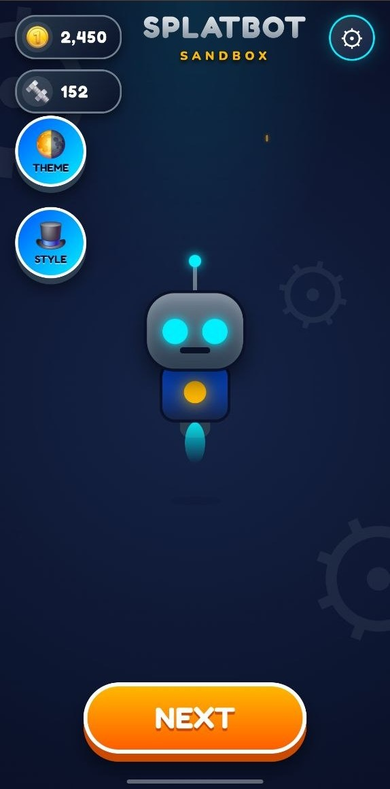
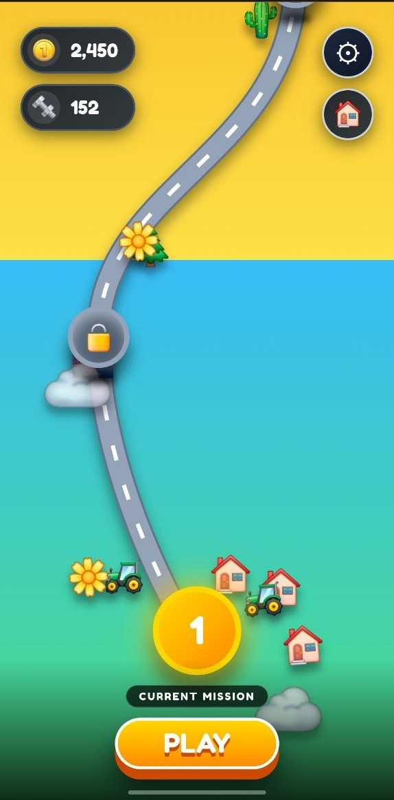
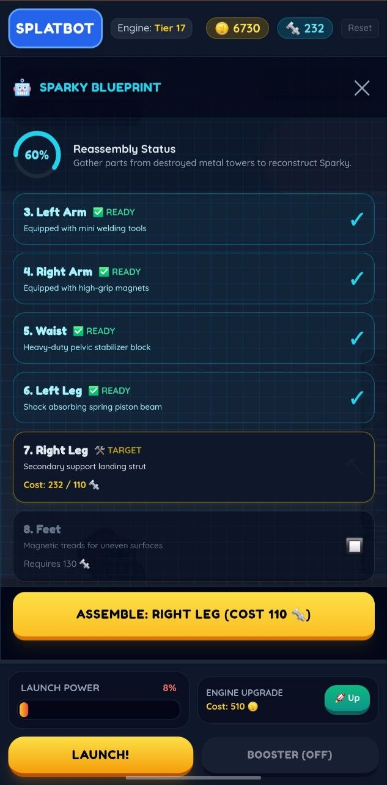
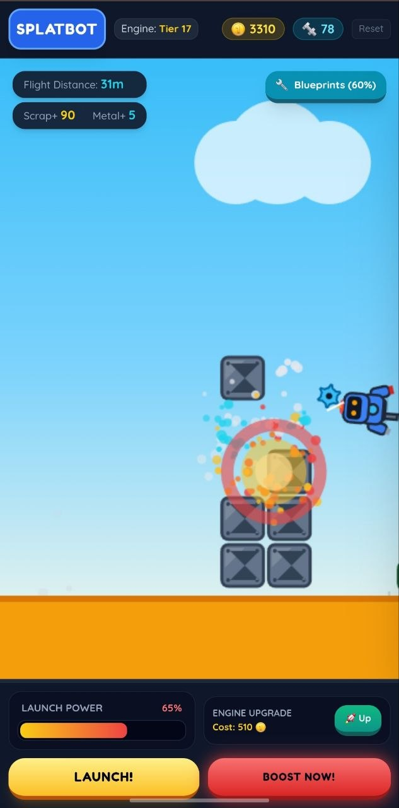
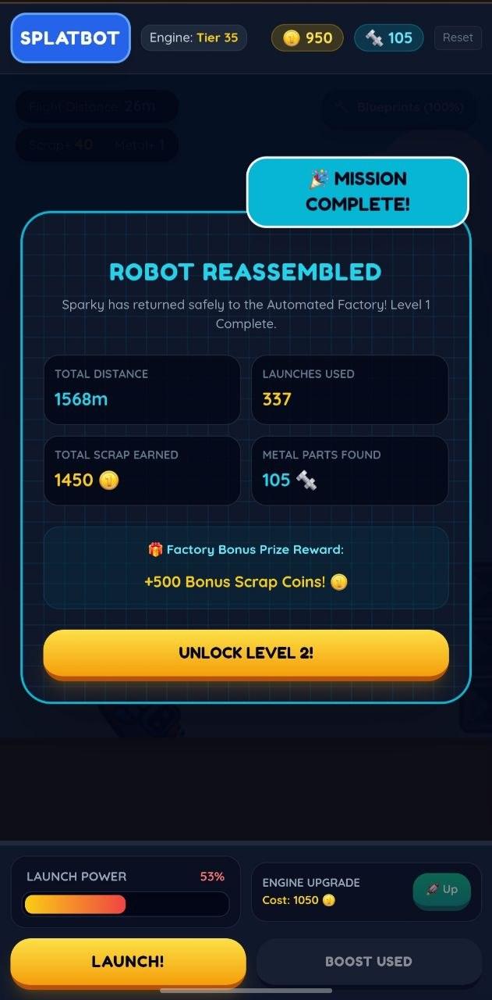

# 🤖 SplatBot Sandbox

SplatBot Sandbox is a fun offline 2D physics-based launcher game inspired by classic arcade progression games. Players launch their robot into the air, perform flips, collect coins, upgrade abilities, and travel through multiple themed worlds.

The game is designed to be easy to play while providing satisfying progression through upgrades, unlockable levels, and rewarding gameplay.

---

## 🎮 Features

- 🚀 Physics-based launching mechanics
- 💰 Coin collection and upgrade system
- 🌍 Multiple themed worlds
  - Forest
  - Desert
  - Snow
  - Night
  - Mountains
- 🗺️ World Map with level progression
- ⭐ Star-based level completion
- 🎯 Mission and achievement system
- 🔊 Sound effects and background music
- 📱 Optimized for Android devices
- 🎨 Kid-friendly colorful graphics
- 💾 Offline gameplay

---

## 📸 Screenshots

| Home | 

|  

| World Map | 

|  

| Mission | 

|  

| Mission | 

|  

| Level Complete |

|  

---

## 🌐 Play the Demo

🎮 **Play SplatBot Sandbox Online**

**https://yash-splatbot-launcher.netlify.app/**

> Experience the latest playable version directly in your browser.

## 🎯 Gameplay

1. Launch your robot.
2. Stay airborne as long as possible.
3. Perform tricks and flips.
4. Collect coins.
5. Upgrade your robot.
6. Unlock new areas.
7. Beat your highest score.

---

## 🚧 Current Status

This project is currently under active development.

Upcoming features include:

- More robots
- More worlds
- Daily rewards
- Better missions
- Leaderboards
- New power-ups

---

## 📂 Project Structure

```
Assets/
Scripts/
Scenes/
Prefabs/
Sprites/
Audio/
Animations/
```

---

## 👨‍💻 Developer

**Yash Chaurasiya**

Computer Science Engineer

Android Developer • Data Analyst • Game Developer

Portfolio:
https://yashchaurasia.in

---

## ⭐ Support

If you like this project, don't forget to give it a ⭐ on GitHub!
